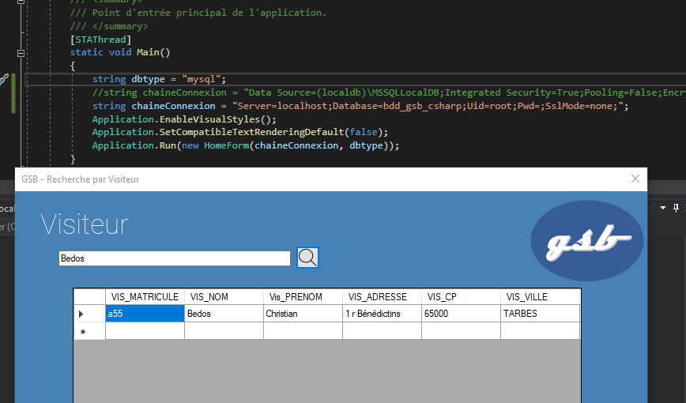
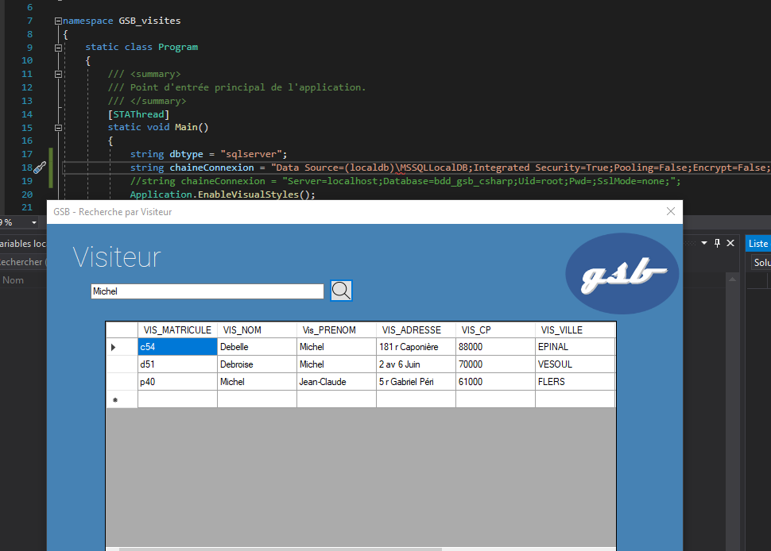
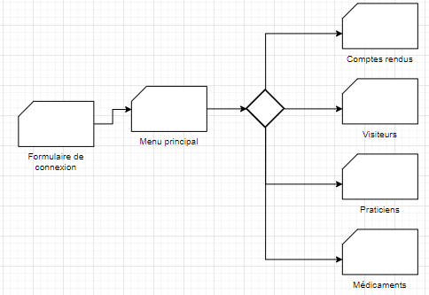
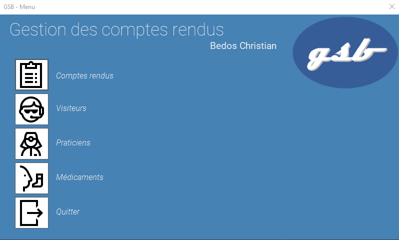
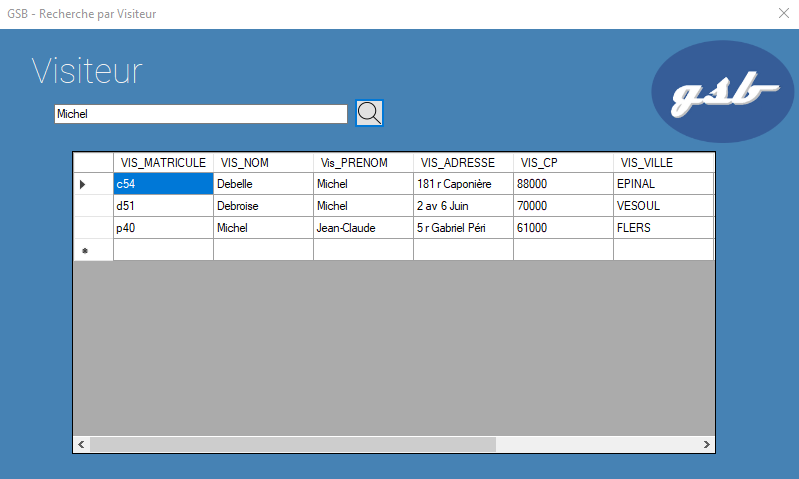
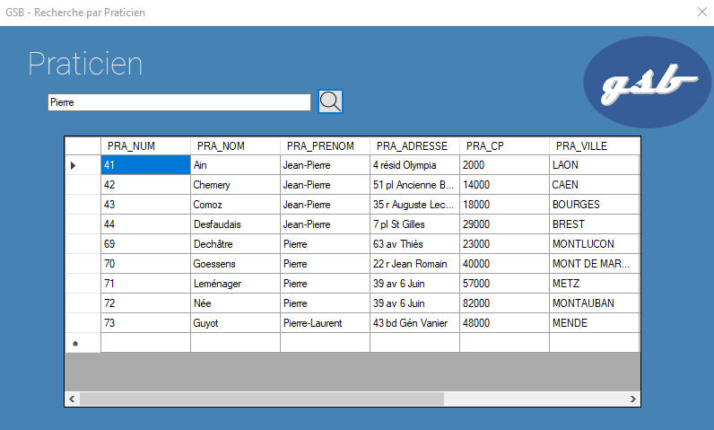
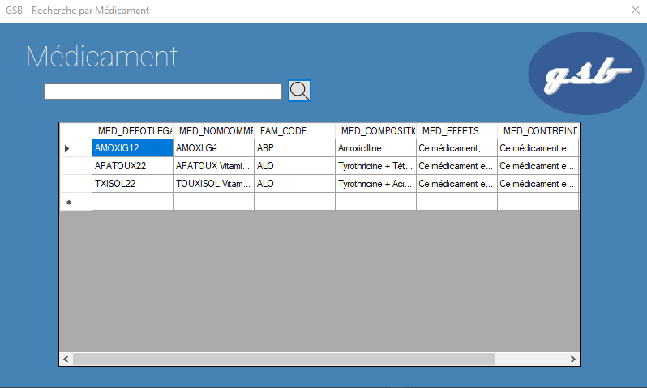
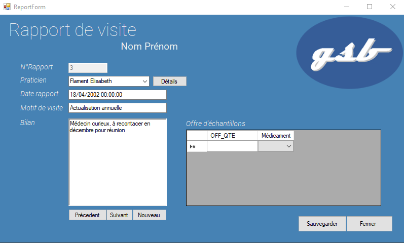

# Application de comptes rendus de visite

> Arthur RICHARD 2TSIO

## [Install & Config](./install.md)

## Architecture logicielle

- Formulaire windows (C# .NET Framework)
- Base de données SQL Server (MSSQL)
- Base de données MariaDB (MySQL)

## Outils utilisés

- Visual Studio 2019
- [draw.io](https://draw.io/)
- Microsoft SQL Server Migration Assistant for MySQL

## Conversion de la base de données MySQL en MSSQL

1. Créer une base de données MSSQL sous VS2019
1. Connecter les deux serveurs de base de données
1. Selectionner la base de données à migrer
1. Selectionner la base de données qui réceptionne
1. Convertir à l'aide de l'outil de Migration en MSSQL
1. Copier le script des données obtenus
1. Créer une nouvelle requête sous VS2019 et collé le script
1. Exécuter la requête d'insertion des données

## Interopérabilté de l'application

Une des contraintes imposées est la non-dépendance à un système de gestion de bases de données relationnelles. C'est à dire que l'application doit fonctionner avec d'autres SGBDR que MySQL. Il est possible de réaliser cela à l'aide d'un curseur adaptatif.

Aperçu de la classe `Cursor.cs`:

```cs
// Cursor.cs
using System;
using System.Data;
using System.Collections.Generic;
using System.Linq;
using System.Text;
using System.Threading.Tasks;
using System.Data.OleDb;
using System.Data.Odbc;
using MySql.Data;
using MySql.Data.MySqlClient;
using MySql.Data.Types;
using System.Data.SqlClient;
using System.Windows.Forms;

namespace GSB_visites
{
    public class Cursor
    {
        string dbType;
        bool end;
        MySqlConnection mysql_connection;
        MySqlCommand mysql_command;
        MySqlDataReader mysql_dataReader;

        OleDbConnection oleDb_connection;
        OleDbCommand oleDb_command;
        OleDbDataReader oleDb_dataReader;

        SqlConnection sqlServer_connection;
        SqlCommand sqlServer_command;
        SqlDataReader sqlServer_dataReader;


        public Cursor(string ch, string db)
        {
            dbType = db;
            switch (db)
            {
                case "sqlserver":
                    sqlServer_connection = new SqlConnection(ch);
                    sqlServer_connection.Open();
                    sqlServer_dataReader = null;
                    break;
                case "access":
                    oleDb_connection = new OleDbConnection(ch);
                    oleDb_connection.Open();
                    oleDb_dataReader = null;
                    break;
                case "mysql":
                    mysql_connection = new MySqlConnection(ch);
                    mysql_connection.Open();
                    mysql_dataReader = null;
                    break;
            }
        }

        public void suivant()
        {
            bool flag = false;
            if (!end)
            {
                switch (dbType)
                {
                    case "mysql":
                        flag = mysql_dataReader.Read();
                        break;
                    case "access":
                        flag = oleDb_dataReader.Read();
                        break;
                    case "sqlserver":
                        flag = sqlServer_dataReader.Read();
                        break;
                }
                if (flag)
                    end = true;
                else
                    end = false;
            }
        }

        public void remplir(string request, DataSet ds, string tableName)
        {
            switch (dbType)
            {
                case "mysql":
                    if (mysql_connection != null)
                    {
                        MySqlDataAdapter mysql_dataAdapter = new MySqlDataAdapter(request, mysql_connection);
                        mysql_dataAdapter.Fill(ds, tableName);
                    }
                    break;
                case "access":
                    if (oleDb_connection != null)
                    {
                        OleDbDataAdapter oleDb_dataAdapter = new OleDbDataAdapter(request, oleDb_connection);
                        oleDb_dataAdapter.Fill(ds, tableName);
                    }
                    break;
                case "sqlserver":
                    if (sqlServer_connection != null)
                    {
                        SqlDataAdapter sqlServer_dataAdapter = new SqlDataAdapter(request, sqlServer_connection);
                        sqlServer_dataAdapter.Fill(ds, tableName);
                    }
                    break;
            }
        }

        public bool reqSelect(string req)
        {
            try
            {
                switch (dbType)
                {
                    case "mysql":
                        mysql_command = new MySqlCommand(req, mysql_connection);
                        mysql_dataReader = mysql_command.ExecuteReader();
                        end = false;
                        if (!mysql_dataReader.Read())
                        {
                            return false;
                        }
                        suivant();
                        break;
                    case "sqlserver":
                        sqlServer_command = new SqlCommand(req, sqlServer_connection);
                        sqlServer_dataReader = sqlServer_command.ExecuteReader();
                        end = false;
                        if (!oleDb_dataReader.Read())
                        {
                            return false;
                        }
                        suivant();
                        break;
                    case "access":
                        oleDb_command = new OleDbCommand(req, oleDb_connection);
                        oleDb_dataReader = oleDb_command.ExecuteReader();
                        end = false;
                        if (!sqlServer_dataReader.Read())
                        {
                            return false;
                        }
                        suivant();
                        break;
                }
                return true;
            }
            catch (Exception e)
            {
                Console.WriteLine(e.Message);
                return false;
                throw;
            }
        }

        public bool reqAdmin(string req)
        {
            try
            {
                switch (dbType)
                {
                    case "mysql":
                        mysql_command = new MySqlCommand(req, mysql_connection);
                        mysql_command.ExecuteNonQuery();
                        break;
                    case "sqlserver":
                        sqlServer_command = new SqlCommand(req, sqlServer_connection);
                        sqlServer_command.ExecuteNonQuery();
                        break;
                    case "access":
                        oleDb_command = new OleDbCommand(req, oleDb_connection);
                        oleDb_command.ExecuteNonQuery();
                        break;
                }
                return true;
            }
            catch (Exception e)
            {
                string msgError = e.Message;
                return false;
                throw;
            }
        }


        public object champ(string nomChamp)
        {
            object reader = null;
            switch (dbType)
            {
                case "mysql":
                    if (mysql_dataReader.HasRows)
                    {
                        reader = mysql_dataReader[nomChamp];
                    }
                    break;
                case "access":
                    if (oleDb_dataReader.HasRows)
                    {
                        reader = oleDb_dataReader[nomChamp];
                    }
                    break;
                case "sqlserver":
                    if (sqlServer_dataReader.HasRows)
                    {
                        reader = sqlServer_dataReader[nomChamp];
                    }
                    break;
            }
            return reader;
        }

        public void fermer()
        {
            switch (dbType)
            {
                case "mysql":
                    if (mysql_dataReader != null) { mysql_dataReader.Close(); }
                    mysql_connection.Close();
                    break;
                case "access":
                    if (oleDb_dataReader != null) { oleDb_dataReader.Close(); }
                    oleDb_connection.Close();
                    break;
                case "sqlserver":
                    if (sqlServer_dataReader != null) { sqlServer_dataReader.Close(); }
                    sqlServer_connection.Close();
                    break;
            }
        }


        public bool fin()
        {
            return end;
        }
    }
}

```

### MySQL

On test en premier lieu que l'application fonctionne avec MySQL

```cs
// Program.cs
using System;
using System.Collections.Generic;
using System.Linq;
using System.Threading.Tasks;
using System.Windows.Forms;

namespace GSB_visites
{
    static class Program
    {
        /// <summary>
        /// Point d'entrée principal de l'application.
        /// </summary>
        [STAThread]
        static void Main()
        {
            string dbtype = "mysql";
            string chaineConnexion = "Server=localhost;Database=bdd_gsb_csharp;Uid=root;Pwd=;SslMode=none;";
            Application.EnableVisualStyles();
            Application.SetCompatibleTextRenderingDefault(false);
            Application.Run(new HomeForm(chaineConnexion, dbtype));
        }
    }
}

```



### MSSQL

Test de connexion entre l'application et SQL Server :

```cs
// Program.cs
using System;
using System.Collections.Generic;
using System.Linq;
using System.Threading.Tasks;
using System.Windows.Forms;

namespace GSB_visites
{
    static class Program
    {
        /// <summary>
        /// Point d'entrée principal de l'application.
        /// </summary>
        [STAThread]
        static void Main()
        {
            string dbtype = "sqlserver";
            string chaineConnexion = "Data Source=(localdb)\MSSQLLocalDB;Integrated Security=True;Pooling=False;Encrypt=False;";
            Application.EnableVisualStyles();
            Application.SetCompatibleTextRenderingDefault(false);
            Application.Run(new HomeForm(chaineConnexion, dbtype));
        }
    }
}

```



## Développement des formulaires

### Ancienne solution logicielle

L'ancienne solution sous Access était organisée de cette manière :



La tâche ici est de répondre au même besoin, sous formulaire windows

### Formulaire de connexion

Aperçu du formulaire de connexion :


```cs
// HomeForm.cs
using System;
using System.Globalization;
using System.Collections.Generic;
using System.ComponentModel;
using System.Data;
using System.Drawing;
using System.Linq;
using System.Text;
using System.Threading.Tasks;
using System.Windows.Forms;
using System.Data.OleDb;
using System.Data.Odbc;
using MySql.Data;
using MySql.Data.MySqlClient;
using MySql.Data.Types;
using System.Data.SqlClient;

namespace GSB_visites
{
    public partial class HomeForm : Form
    {
        private string chaineConnexion = "";
        private string type = "";
        public HomeForm(string ch, string dbtype)
        {
            InitializeComponent();
            this.chaineConnexion = ch;
            this.type = dbtype;
        }

        private void loginBtn_Click(object sender, EventArgs e)
        {
            try
            {
                Cursor db = new Cursor(this.chaineConnexion, this.type);
                string name = loginTxt.Text;
                string year = passwordTxt.Text.Substring(7, 4);
                string day = passwordTxt.Text.Substring(0, 2);
                string month = passwordTxt.Text.Substring(3, 3);
                string date = dateParser(year, month, day);
                string request_login = $"SELECT visiteur.VIS_NOM, visiteur.VIS_PRENOM, visiteur.VIS_DATEEMBAUCHE FROM visiteur WHERE visiteur.VIS_DATEEMBAUCHE = '{date}' AND visiteur.VIS_NOM = '{name}';";
                if (db.reqSelect(request_login))
                {
                    string user = db.champ("VIS_NOM") + " " + db.champ("VIS_PRENOM");
                    MessageBox.Show($"Bienvenue {user}", "GSB Connexion", MessageBoxButtons.OK, MessageBoxIcon.Information);
                    MenuForm menu = new MenuForm(this.chaineConnexion, this.type, user);
                    menu.Show();
                    this.Hide();
                }
                else
                {
                    MessageBox.Show("Connexion échouée", "GSB Connexion", MessageBoxButtons.OK, MessageBoxIcon.Error);
                    loginTxt.Text = "";
                    passwordTxt.Text = "";
                }
                db.fermer();
            }
            catch (Exception ex)
            {
                MessageBox.Show(ex.Message, "GSB Connexion", MessageBoxButtons.OK, MessageBoxIcon.Error);
                loginTxt.Text = "";
                passwordTxt.Text = "";
                throw;
            }
        }

        public string dateParser(string year, string month, string day)
        {
            int parsedMonth = DateTime.Parse("1." + month + " 2000").Month;
            DateTime parsedDate = new DateTime(Int32.Parse(year), parsedMonth, Int32.Parse(day));
            string date = parsedDate.ToString("yyyy-MM-dd");
            return date;
        }
    }
}

```

### Formulaire du menu principal

Aperçu du menu principal :



On peut voir ici, que la chaine de connexion est héritée depuis le formulaire de départ, afin d'être écrite une seule fois dans le `Program.cs`. Cette chaine de connexion est utilisée dans les autres formulaires pour afficher des tables, modifier les comptes rendus et se connecter à l'application en temps qu'utilisateur.

```cs
// MenuForm.cs
using System;
using System.Collections.Generic;
using System.ComponentModel;
using System.Data;
using System.Drawing;
using System.Linq;
using System.Text;
using System.Threading.Tasks;
using System.Windows.Forms;

namespace GSB_visites
{
    public partial class MenuForm : Form
    {
        private string chaineConnexion = "";
        private string type = "";
        private string username;
        public MenuForm(string ch, string dbtype, string user)
        {
            this.chaineConnexion = ch;
            this.username = user;
            this.type = dbtype;
            InitializeComponent();
            lbl_user.Text = username;
            toolTip_btnMenuCR.SetToolTip(btnMenuCR, "Comptes rendus");
            toolTip_btnMenuVisiteur.SetToolTip(btnMenuVisiteur, "Visiteurs");
            toolTip_btnMenuPraticien.SetToolTip(btnMenuPracticien, "Praticiens");
            toolTip_btnMenuMedicament.SetToolTip(btnMenuMedicament, "Médicaments");
            toolTip_btnMenuQuitter.SetToolTip(btnMenuQuit, "Fermer le menu");
        }

        private void btnMenuQuit_Click(object sender, EventArgs e)
        {
            HomeForm home = new HomeForm(this.chaineConnexion, this.type);
            home.Show();
            this.Close();
        }

        private void btnMenuCR_Click(object sender, EventArgs e)
        {
            ReportForm report = new ReportForm(this.chaineConnexion, this.type, this.username);
            report.Show();
        }

        private void btnMenuVisiteur_Click(object sender, EventArgs e)
        {
            SearchForm searchVisiteur = new SearchForm(this.chaineConnexion, this.type, "Visiteur");
            searchVisiteur.Show();
        }

        private void btnMenuPracticien_Click(object sender, EventArgs e)
        {
            SearchForm searchPraticien = new SearchForm(this.chaineConnexion, this.type, "Praticien");
            searchPraticien.Show();
        }

        private void btnMenuMedicament_Click(object sender, EventArgs e)
        {
            SearchForm searchMedicament = new SearchForm(this.chaineConnexion, this.type, "Médicament");
            searchMedicament.Show();
        }
    }
}


```

### Formulaire de recherche

La recherche, même si les résultats sont différents selon la catégorie, ne représente qu'un besoin unique d'après les normes DRY (Don't Repeat Yourself). J'ai donc décidé de réaliser qu'un seul formulaire de recherche qui s'adapte en fonction de la catégorie de recherche. On peut le distinguer dans le code du formulaire du menu principal avec notamment la création de plusieurs `SearchForm`, mais avec des catégories différentes

Aperçu de la recherche de visiteurs :



Aperçu de la recherche de praticiens :



Aperçu de la recherche de médicaments :



```cs
// SearchForm.cs
using System;
using System.Collections.Generic;
using System.ComponentModel;
using System.Data;
using System.Drawing;
using System.Linq;
using System.Text;
using System.Threading.Tasks;
using System.Windows.Forms;

namespace GSB_visites
{
    public partial class SearchForm : Form
    {
        private string categorie = "";
        private string type = "";
        private string chaineConnexion;
        private IDictionary<string, string> dict = new Dictionary<string, string>();

        public SearchForm(string ch, string dbtype, string cat, string nom=null)
        {
            InitializeComponent();
            this.categorie = cat;
            this.type = dbtype;
            this.chaineConnexion = ch;
            lbl_cat.Text = categorie;
            this.Text += $" {categorie}";
            this.dict.Add("Médicament", "medicament");
            this.dict.Add("Visiteur", "visiteur");
            this.dict.Add("Praticien", "praticien");
            if (nom != null)
            {
                txtSearch.Text = nom;
                this.btnSearch_Click(btnSearch, EventArgs.Empty);
            }
        }


        private void btnSearch_Click(object sender, EventArgs e)
        {
            try
            {
                dgSearch.Hide();
                dgSearch.DataSource = null;
                dgSearch.Refresh();

                string table = this.dict[this.categorie];
                string searchInput = txtSearch.Text ?? null;
                string requete = "";
                if (searchInput == null)
                {
                    requete = $"SELECT * FROM {table}";
                }
                switch (this.categorie)
                {
                    case "Visiteur":
                        requete = $"SELECT * FROM visiteur WHERE VIS_NOM LIKE '%{searchInput}%' OR VIS_PRENOM LIKE '%{searchInput}%' OR VIS_MATRICULE LIKE '%{searchInput}%' OR VIS_CP LIKE '%{searchInput}%';";
                        break;
                    case "Praticien":
                        requete = $"SELECT * FROM praticien WHERE PRA_NOM LIKE '%{searchInput}%' OR PRA_PRENOM LIKE '%{searchInput}%' OR PRA_CP LIKE '%{searchInput}%' OR PRA_COEFNOTORIETE LIKE '%{searchInput}%';";
                        break;
                    case "Médicament":
                        requete = $"SELECT * FROM medicament WHERE MED_NOMCOMMERCIAL LIKE '%{searchInput}%' OR MED_DEPOTLEGAL LIKE '%{searchInput}%';";
                        break;
                }
                Cursor db = new Cursor(this.chaineConnexion, this.type);
                DataSet ds = new DataSet();
                db.remplir(requete, ds, table);
                dgSearch.DataSource = ds;
                dgSearch.DataMember = table;
                db.fermer();
                dgSearch.Show();
            }
            catch (Exception err)
            {
                string header = $"GSB Recherche par {this.categorie}";
                MessageBox.Show(err.Message, header, MessageBoxButtons.OK, MessageBoxIcon.Error);
                throw;
            }
        }
    }
}


```

### Formulaire de saisie de compte rendus

Aperçu du formulaire de saisie de compte rendus :



```cs
// ReportForm.cs
using System;
using System.Collections.Generic;
using System.ComponentModel;
using System.Data;
using System.Drawing;
using System.Linq;
using System.Text;
using System.Threading.Tasks;
using System.Windows.Forms;

namespace GSB_visites
{
    public partial class ReportForm : Form
    {
        private string chaineConnexion = "";
        private string type = "";
        private string username = "";
        public ReportForm(string ch, string dbtype, string user)
        {
            InitializeComponent();
            this.chaineConnexion = ch;
            this.type = dbtype;
            this.username = user;
            txtNumRapport.Enabled = false;
        }

        private void btnDetails_Click(object sender, EventArgs e)
        {
            string infoPra = cbxPraticien.SelectedIndex.ToString();
            SearchForm searchPraticien = new SearchForm(chaineConnexion, "Praticien", infoPra);
            searchPraticien.Show();
        }

        private void ReportForm_Load(object sender, EventArgs e)
        {
            load_Praticiens();
            load_Report();
            reset_Echantillon();
            load_Echantillon();
        }

        private void load_Praticiens()
        {
            Cursor db = new Cursor(this.chaineConnexion, this.type);
            db.reqSelect("SELECT PRA_NOM, PRA_PRENOM FROM praticien;");
            bool fin = db.fin();
            while (!db.fin())
            {
                string value = db.champ("PRA_NOM").ToString() + " " + db.champ("PRA_PRENOM").ToString();
                cbxPraticien.Items.Add(value);
                db.suivant();
            }
            db.fermer();
        }

        private void load_Report()
        {
            Cursor db = new Cursor(this.chaineConnexion, this.type);
            string cbxValue = cbxPraticien.Text;
            string[] infoPra = cbxValue.Split(' ');
            string requete = $"SELECT VIS_MATRICULE, RAP_NUM, PRA_NUM, RAP_DATE, RAP_BILAN, RAP_MOTIF FROM rapport_visite WHERE PRA_NUM = {this.getNumPra(infoPra[0], infoPra[1])};";
            db.reqSelect(requete);
            txtNumRapport.Text = db.champ("RAP_NUM").ToString();
            txtBilan.Text = db.champ("RAP_BILAN").ToString();
            txtMotif.Text = db.champ("RAP_MOTIF").ToString();
            txtDate.Text = db.champ("RAP_DATE").ToString();
            db.fermer();
        }

        private void load_Echantillon()
        {
            Cursor db = new Cursor(this.chaineConnexion, this.type);
            string numRapport = txtNumRapport.Text;
            string requete = $"SELECT MED_DEPOTLEGAL, OFF_QTE FROM offrir WHERE RAP_NUM = {numRapport}";
            DataSet ds = new DataSet();
            db.remplir(requete, ds, "offrir");
            dgEchantillon.DataSource = ds;
            dgEchantillon.DataMember = "offrir";
            var cbox = new DataGridViewComboBoxColumn
            {
                AutoSizeMode = DataGridViewAutoSizeColumnMode.AllCells,
                DataPropertyName = dgEchantillon.Columns["MED_DEPOTLEGAL"].Name,
                HeaderText = "Médicament"
            };
            dgEchantillon.Columns.Add(cbox);
            var r = dgEchantillon.Columns.OfType<DataGridViewTextBoxColumn>().Where(x => x.Name == "MED_DEPOTLEGAL").FirstOrDefault();
            dgEchantillon.Columns.Remove(r);
            db.fermer();
            dgEchantillon.Show();
        }

        private void reset_Echantillon()
        {
            dgEchantillon.Hide();
            dgEchantillon.DataSource = null;
            dgEchantillon.Refresh();
        }

        private void btnClose_Click(object sender, EventArgs e)
        {
            this.Hide();
        }

        private void cbxPraticien_SelectedIndexChanged(object sender, EventArgs e)
        {
            this.ReportForm_Load(this, EventArgs.Empty);
        }

        private int getNumPra(string nom, string prenom)
        {
            Cursor db = new Cursor(this.chaineConnexion, this.type);
            string req = $"SELECT PRA_NUM FROM praticien WHERE PRA_NOM = '{nom}' AND PRA_PRENOM = '{prenom}';";
            db.reqSelect(req);
            string result = db.champ("PRA_NUM").ToString();
            return Int32.Parse(result);
        }

        private void btnSave_Click(object sender, EventArgs e)
        {
            DialogResult dresult = MessageBox.Show("Etes vous sur ?", "GSB Comptes rendus", MessageBoxButtons.OKCancel, MessageBoxIcon.Question);
            if (dresult == DialogResult.OK)
            {
                Cursor db = new Cursor(this.chaineConnexion, this.type);
                string req1 = "UPDATE FROM rapport_visite SET ";
                req1 += $"RAP_DATE='{txtDate.Text}', ";
                req1 += $"RAP_BILAN='{txtBilan.Text}', ";
                req1 += $"RAP_MOTIF='{txtMotif.Text}', ";
                req1 += $"RAP_DATE='{txtDate.Text}', ";
                req1 += $"WHERE RAP_NUM = {txtNumRapport.Text}";
                db.reqAdmin(req1);
                db.fermer();
                Cursor cs = new Cursor(this.chaineConnexion, this.type);
                string req2 = "UPDATE FROM offrir SET ";
                req2 += $"OFF_QTE={dgEchantillon.Columns["OFF_QTE"]} ";
                req2 += $"WHERE MED_DEPOTLEGAL='{dgEchantillon.Columns["OFF_QTE"]}' AND ";
                req2 += $"RAP_NUM={txtNumRapport.Text} AND ";
                req2 += $"VIS_MATRICULE='{this.getMatricule()}'";
                cs.reqAdmin(req2);
                cs.fermer();
                MessageBox.Show("Rapport modifié");
            }
        }

        private string getMatricule()
        {
            Cursor db = new Cursor(chaineConnexion, type);
            string[] infoVis = username.Split(' ');
            string requete = $"SELECT VIS_MATRICULE FROM visiteur WHERE VIS_NOM = '{infoVis[0]}' AND VIS_PRENOM = '{infoVis[1]}';";
            db.reqSelect(requete);
            return db.champ("VIS_MATRICULE").ToString();
        }
    }
}

```
